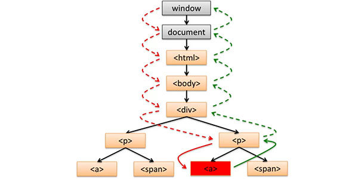
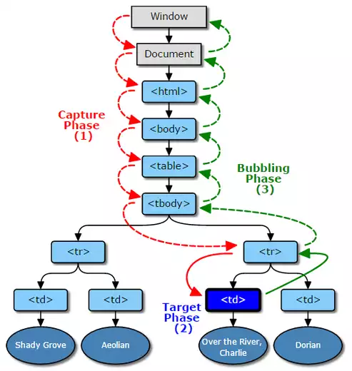
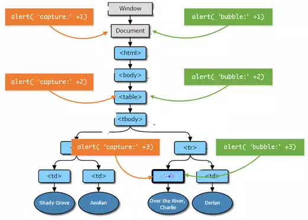
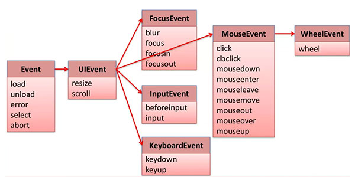

[TOC]


# DOM事件

何为 DOM 事件，HTML DOM 使JavaScript 有能力对 HTML 事件做出反应。（例如，点击 DOM 元素，键盘被按，输入框输入内容以及页面加载完毕等）

## 事件流

一个 DOM 事件可以分为`捕获过程`、`触发过程`、`冒泡过程`。 DOM 事件流为 DOM 事件的处理及执行的过程。下面以一个`[`](undefined)元素被点击为例。



1. [红虚线]Capture Phase（事件捕获过程）当 DOM 事件发生时，它会从window节点一路跑下去直到触发事件元素的父节点为止，去捕获触发事件的元素。
2. [红绿实线]Target Phase（事件触发过程）当事件被捕获之后就开始执行事件绑定的代码
3. [绿虚线]Bubble Phase（冒泡过程）当事件代码执行完毕后，浏览器会从触发事件元素的父节点开始一直冒泡到window元素（**即元素的祖先元素也会触发这个元素所触发的事件**）

**关于捕获过程的补充**

如果有一个支持三个阶段的事件，它一定在触发时遵循下面的顺序：

```
Capture -> Target -> Bubbling
```



使用下面的代码来举例：

```
// 添加Capture阶段事件
docuemnt.addEventListener('click',function(){
    alert('capture：'+1);
},true);
tableNode.addEventListener('click',function(){
    alert('capture：'+2);
},true);
tdNode.addEventListener('click',function(){
    alert('capture：'+3);
},true);

// 添加Bubbling阶段事件
docuemnt.addEventListener('click',function(){
    alert('bubble：'+1);
});
tableNode.addEventListener('click',function(){
    alert('bubble：'+2);
});
tdNode.addEventListener('click',function(){
    alert('bubble：'+3);
});
```

输出结果为：

```
capture：1
capture：2
capture：3
bubble：3
bubble：2
bubble：1
```



```
// 对document添加了三个bubbling阶段的事件
document.addEventListener('click',function(){
    alert(1);
});
document.addEventListener('click',function(){
    alert(2);
});
document.addEventListener('click',function(){
    alert(3);
});
```

如上面的代码所示，其为同一节点添加了同一阶段的多个事件，那执行顺序如何呢？ 早期并没有规范定义，DOM 3 中规范已经明确规定 同一节点同一阶段的事件应按照注册函数的顺序执行。

> 在实际项目过程中，某些情况下比如若干的组件或者模块都需要监听某个节点的某个事件，但是组件或者模块的生成（即添加事件的时机）是不一定保证顺序的，所以这个情况下如果某个组件对这个节点的这个事件的优先级特别高（需要保证必须先触发这个组件里的这个事件）而这个平台又支持这个阶段事件的话可以添加 capture 阶段事件，用三阶段的顺序来保证，比如移动平台模拟手势的实现会添加 document 上 touchXXX 的 capture 阶段事件，以优先识别手势操作 当然实践过程中考虑到不同浏览器对三阶段支持的情况的差异，大部分情况下都采用的是 bubbling 阶段的事件
>
> —— 蔡剑飞 网易前端工程师

NOTE：低版本 IE 中并未实现捕获过程。也不是所有事件均存在这三个完整的过程（例如 `load` 没有冒泡事件）

NOTE+：在这三个阶段中无论将**事件捕获**和**事件处理**注册到任意一个父或祖父节点上都会被触发事件。

## 事件注册

事件注册，取消以及触发其作用对象均为一个 DOM 元素。

### 注册事件（addEventListener）

```
eventTarget.addEventListener(type, listener[,useCapture])
```

- evenTarget 表示要绑定事件的DOM元素
- type 表示要绑定的事件，如："click"
- listener 表示要绑定的函数
- useCapture 可选参数，表示是否捕获过程

NOTE：`useCapture` 为设定是否为捕获过程，默认事件均为冒泡过程，只有 `useCapture` 为 `true` 时才会启用捕获过程。

```
// 获取元素
var elem = document.getElemenyById('id');

// 事件处理函数
var clickHandler = function(event) {
  // statements
};

// 注册事件
elem.addEventListener('click', clickHandler, false);

// 第二种方式，不建议使用
elem.onclick = clickHandler;
// 或者来弥补只可触发一个处理函数的缺陷
elem.onclick = function(){
  clickHandler();
  func();
  // 其他处理函数
};
```

### 取消事件（removeEventListener）

```
eventTarget.removeEventListener(type, listener[,useCapture]);
```

- evenTarget 表示要绑定事件的DOM元素
- type 表示要绑定的事件，如："click"
- listener 表示要绑定的函数
- useCapture 可选参数，表示是否捕获过程

```
// 获取元素
var elem = document.getElemenyById('id');

// 取消事件
elem.removeEventListener('click', clickHandler, false);

// 第二种方式。不建议使用
elem.onclick = null;
```

### 触发事件（dispatchEvent）

点击元素，按下按键均会触发 DOM 事件，当然也可以以通过代码来触发事件。

```
eventTarget.dispatchEvent(type);

// 获取元素
var elem = document.getElemenyById('id');

// 触发事件
elem.dispatchEvent('click');
```

### 浏览器兼容型

以上均为 **W3C**定义的标准定义，但早期浏览器 IE8 及其以下版本，均没有采用标准的实现方式。不过这些低版本浏览器也提供了对于 DOM 事件的注册、取消以及触发的实现。

**事件注册与取消**，`attchEvent/detachEvent`。**事件触发**，`fireEvent(e)`，其也**不存在**捕获阶段（Capture Phase）。

#### 兼容低版本代码实现

**注册事件**

```
/**
 * DOM2添加事件
 * @param ele
 * @param {string} type
 * @param {EventListener|Function} listener
 * @param {boolean} [useCapture = false]
 */
var setaddEvent = function (ele, type, listener, useCapture) {
    useCapture = useCapture || false;
    if (ele.addEventListener) {
        ele.addEventListener(type, listener, useCapture);
    } else if (ele.attachEvent) {
        ele.attachEvent("on" + type, listener);
    } else {
        ele["on" + type] = listener;
    }
};
```

**取消事件**

```
/**
 * DOM2移除事件
 * @param ele
 * @param {string} type
 * @param {EventListener|Function} listener
 * @param {boolean} [useCapture = false]
 */
var setremoveEvent = function (ele, type, listener, useCapture) {
    useCapture = useCapture || false;
    if (ele.removeEventListener) {
        ele.removeEventListener(type, listener, useCapture);
    } else if (ele.detachEvent) {
        ele.detachEvent("on" + type, listener);
    } else {
        ele["on" + type] = null;
    }
};
```
## 事件对象

调用事件处理函数时传入的信息对象，这个对象中含有关于这个事件的详细状态和信息，它就是事件对象 `event`。其中可能包含鼠标的位置，键盘信息等。

```
// 获取元素
var elem = document.getElemenyById('id');

// 事件处理函数
var clickHandler = function(event) {
  // statements
};

// 注册事件
elem.addEventListener('click', clickHandler, false);
```

NOTE：在低版本 IE 中事件对象是被注册在 `window` 之上而非目标对象上。使用下面的兼容代码既可解决。

```
var elem = document.getElemenyById('id');

// 事件处理函数
var clickHandler = function(event) {
  event = event || window.event;
  // statements
};
```

### 属性和方法

#### 通用属性和方法

**属性**

- type 事件类型
- target(srcElement IE 低版本) 事件触发节点
- currentTarget 处理事件的节点

**方法**

- stopPropagation 阻止事件冒泡传播
- preventDefault 阻止默认行为
- stopImmediatePropagation 阻止冒泡传播

##### 阻止事件传播

`event.stopPropagation()`（W3C规范方法），如果在当前节点已经处理了事件，则可以阻止事件被冒泡传播至 DOM 树最顶端即 `window` 对象。

`event.stopImmediatePropagation()` 此方法同上面的方法类似，除了阻止将事件冒泡传播值最高的 DOM 元素外，还会阻止在此事件后的事件的触发。

`event.cancelBubble=true` 为 IE 低版本中中对于阻止冒泡传播的实现。

##### 阻止默认行为

默认行为是指浏览器定义的默认行为（点击一个链接的时候，链接默认就会打开。当我们双击文字的时候，文字就会被选中），比如单击链接可以打开新窗口。

`Event.preventDefault()` 为 W3C 规范方法，在 IE 中的实现方法为 `Event.returnValue=false`。

## 事件分类


### Event



| 事件类型   | 是否冒泡 | 元素                        | 默认事件 | 元素例子                  |
| ------ | ---- | ------------------------- | ---- | --------------------- |
| load   | NO   | Window, Document, Element | None | window, image, iframe |
| unload | NO   | Window, Document, Element | None | window                |
| error  | NO   | Window, Element           | None | window, image         |
| select | NO   | Element                   | None | input, textarea       |
| abort  | NO   | Window, Element           | None | window, image         |

#### window

- load 页面全部加载完毕
- unload 离开本页之前的卸载
- error 页面异常
- abort 取消加载

#### image

- load 图片加载完毕
- error 图标加载错误
- abort 取消图标加载

在目标图标不能正常载入时，载入备份替代图来提供用户体验。

```

```

### 用户界面事件（UIEvent）

| 事件类型   | 是否冒泡   | 元素                | 默认事件 | 元素例子           |
| ------ | ------ | ----------------- | ---- | -------------- |
| resize | NO     | Window, Element   | None | window, iframe |
| scroll | NO/YES | Document, Element | None | document, div  |

> NOTE：
>
> `resize` 为改变浏览器或`iframe`的窗体大小时会触发事件，
>
> `scroll` 则会在滑动内容时触发，
>
> 作用于 `Document`则不会冒泡，作用于内部元素则会冒泡。

### 鼠标事件（MouseEvent）

DOM 事件中最常见的事件之一。

| 事件类型                | 是否冒泡 | 元素      | 默认事件                       | 元素例子 |
| ------------------- | ---- | ------- | -------------------------- | ---- |
| click：鼠标点击          | YES  | Element | focus/activation           | div  |
| dbclick：鼠标双击        | YES  | Element | focus/activation/select    | div  |
| mousedown：鼠标按钮按下    | YES  | Element | drag/scroll/text selection | div  |
| mouseup：鼠标按钮释放      | YES  | Element | context menu               | div  |
| mosuemove：光标位于元素并移动 | YES  | Element | None                       | div  |
| mouseout：光标移出       | YES  | Element | None                       | div  |
| mouseover：光标移入      | YES  | Element | None                       | div  |
| mouseleave：光标移出     | NO   | Element | None                       | div  |
| mouseenter：光标移入     | NO   | Element | None                       | div  |

NOTE：`mouseenter` 与 `mouseover` 的区别为前者在鼠标在子元素直接移动不会触发事件，而后者会触发。 `mouseleave`与 `mouseout` 同上相似。

####属性

1. MouseEvent.altKey：如果alt键返回true，按下鼠标事件时被触发。

2. MouseEvent.ctrlKey：如果ctrl键返回true，按下鼠标事件时被触发。

3. MouseEvent.shiftKey：如果shift键返回true，按下鼠标事件时被触发。

4. MouseEvent.metaKey：如果meta键返回true，按下鼠标事件时被触发。

5. MouseEvent.button：当鼠标事件被触发返回对应鼠标键数字，(0, 1, 2) 鼠标的间位。 

6. MouseEvent.buttons：当鼠标事件被触发被按下的按钮


7. MouseEvent.clientX：鼠标指针的X坐标距离浏览器可视窗口的坐标。

8. MouseEvent.clientY：鼠标指针的Y坐标距离浏览器可视窗口的坐标。

9. MouseEvent.x：别名MouseEvent.clientX。（火狐不支持）

10. MouseEvent.y：别名 MouseEvent.clientY。（火狐不支持）

11. MouseEvent.screenX：相对于全屏的鼠标指针的X坐标的坐标。

12. MouseEvent.screenY：相对于全屏的鼠标指针的Y坐标坐标。

13. MouseEvent.offsetX：相对于所述目标节点的填充边缘的位置的鼠标指针的X坐标。

14. MouseEvent.offsetY：相对于所述目标节点的填充边缘的位置的鼠标指针的Y坐标。

15. MouseEvent.pageX：相对于整个文档的鼠标指针的X坐标。（IE9以下不支持）

16. MouseEvent.pageY：相对于整个文档的鼠标指针的Y坐标。（IE9以下不支持）

   ```
   /**
    * 获取page事件
    * @param event
    * @returns {{x: (*|Number), y: (*|Number)}}
    */
   var getPage = function (event) {
       return {
           x: event.pageX || event.clientX + getScroll().top,
           y: event.pageY || event.clientY + getScroll().left
       }
   };
   ```


17. MouseEvent.movementX：相对于最后的位置的鼠标指针的X坐标mousemove事件。（IE不支持）

18. MouseEvent.movementY：相对于最后的位置的鼠标指针的Y坐标mousemove事件。（IE不支持）

19. MouseEvent.region：返回受事件影响的命中区域的ID。如果没有命中区受到影响，null则返回。

20. MouseEvent.relatedTarget：该事件的次级目标，如果存在的话。


   **下面的事件未标准化**

21. MouseEvent.which：当鼠标事件被触发被按下的按钮。

22. MouseEvent.mozPressure：适用于生成事件时，触摸或平板设备的压力大小; 这个值之间的范围0.0（最小压力）和1.0（最大压力）。

23. MouseEvent.mozInputSource：设备生成事件的类型（之一MOZ_SOURCE_*下面列出的常量）。这让你，例如，确定是否由一个实际的鼠标或触摸事件（可能影响精度的与您解释与事件相关联的坐标的程度）产生的鼠标事件。

24. MouseEvent.webkitForce：当点击应用的压力大小

#### 常量（未标准化）

- MouseEvent.WEBKIT_FORCE_AT_MOUSE_DOWN：必要的正常的点击最小力
- MouseEvent.WEBKIT_FORCE_AT_FORCE_MOUSE_DOWN：必需的力量点击最小力

> NOTE:
>
> ***鼠标事件顺序***：鼠标的移动过程中会产生很多事件。事件的监察频率又浏览器决定。
>
> 例子：从元素A 上方移动过
>
> mousemove ->mouseover(A) -> mouseenter(A) -> mousemove(A) -> mouseout(A) ->mouseleave(A)
>
> 例子：点击元素
>
> mousedown ->[mousemove] -> mouseup -> click

### 键盘事件（KeyboardEvent）

其用于处理键盘事件。

**Note:** `KeyboardEvent` 表示刚刚发生在按键上的事情。 当你需要处理文本输入的时候，使用 HTML5 `input` 事件代替。例如，用户使用手持系统如平板电脑输入时， 按键事件可能不会触发。

| 事件类型    | 是否冒泡 | 元素      | 默认事件                                    | 元素例子        |
| ------- | ---- | ------- | --------------------------------------- | ----------- |
| keydown | YES  | Element | beforeInput/input/focus/blur/activation | div,  input |
| keyup   | YES  | Element | None                                    | div,  input |

#### 属性

1. KeyboardEvent.key：按下的键字符串。（IE9以下不支持）
2. KeyboardEvent.keyCode：按下的键对应值。
3. KeyboardEvent.code：返回由事件所表示的键的代码值。
4. ctrlKey, shiftKey, altKey, metaKey：对应ctrl,shift,alt.meta键，返回值boolean。
5. KeyboardEvent.repeat：代表按键不松开为 true。（只有火狐支持）
6. KeyboardEvent.which
7. KeyboardEvent.charCode


### 滚轮事件（WheelEvent）

`WheelEvent` DOM事件会在用户滚动鼠标滚轮或操作其他类似的输入设备时触发.

这是标准的轮事件接口使用。老版本的浏览器实现了两非标和非跨浏览器兼容的mousewheelevent和mousescrollevent接口。使用此接口，避免后两个。

NOTE：只支持IE9以上

#### 属性

| 名称          | 类型              | 描述                 |
| ----------- | --------------- | ------------------ |
| `deltaX`    | `float`         | 水平滚动量 只读**.**      |
| `deltaY`    | `float`         | 垂直滚动量 只读**.**      |
| `deltaZ`    | `float`         | z轴滚动量   只读**.**    |
| `deltaMode` | `unsigned long` | 鼠标滚轮偏移量的单位 只读**.** |

#### 常量

**Delta 模式**

| 名称                | 值      | 描述         |
| ----------------- | ------ | ---------- |
| `DOM_DELTA_PIXEL` | `0x00` | 增量值的单位为像素. |
| `DOM_DELTA_LINE`  | `0x01` | 增量值的单位为行   |
| `DOM_DELTA_PAGE`  | `0x02` | 增量值的单位为页   |

### 焦点事件（FocusEvent）

其用于处理元素获得或失去焦点的事件。（例如输入框的可输入状态则为获得焦点，点击外部则失去焦点）

| 事件类型     | 是否冒泡 | 元素               | 默认事件 | 元素例子           |
| -------- | ---- | ---------------- | ---- | -------------- |
| blur     | NO   | Window,  Element | None | window,  input |
| focus    | NO   | Window,  Element | None | window,  input |
| focusin  | YES  | window,  Element | None | window,  input |
| focusout | YES  | window,  Element | None | window,  input |

> NOTE：
>
> blur 失去焦点时，focus 获得焦点时
>
> focusin 即将获得焦点，focusout即将失去焦点
>
> 后者火狐不支持

#### 属性

| 属性            | 类型          | 描述         |
| ------------- | ----------- | ---------- |
| target        | EventTarget | 事件目标失去焦点。  |
| type          | DOMString   | 事件的类型。     |
| bubbles       | Boolean     | 该事件是否正常气泡? |
| cancelable    | Boolean     | 事件是否撤销？    |
| relatedTarget | 事件目标（DOM元素） | 事件目标接收焦点。  |

FocusEvent.relatedTarget

一个元素失去，既另一个元素获得焦点。这里的 relatedTarget 则为相对的那个元素。 

- relatedTarget（只能用于focusin和focusout事件）

### 表单事件

| 属性     | 描述                                       | DOM  |
| :----- | :--------------------------------------- | :--- |
| 属性     | 描述                                       | DOM  |
| change | 该事件在表单元素的内容改变时触发(`<input>`, `<keygen>`, `<select>`, 和 `<textarea>`) | 2    |
| input  | 元素获取用户输入时触发                              | 3    |
| reset  | 表单重置时触发                                  | 2    |
| search | 用户向搜索域输入文本时触发 (`<input="search">`)       | 2    |
| select | 用户选取文本时触发 ( `<input>` 和 `<textarea>`)    | 2    |
| submit | 表单提交时触发                                  | 2    |


### 输入框输入事件（InputEvent）

输入框输入内容则会触发输入事件。

| 事件类型        | 是否冒泡 | 元素      | 默认事件                | 元素例子  |
| ----------- | ---- | ------- | ------------------- | ----- |
| beforeInput | YES  | Element | update  DOM Element | input |
| input       | YES  | Element | None                | Input |

> NOTE：beforeInput 为在按键按下后即将将输入字符显示之前生成的事件。
>
> NOTE+：IE低版本并没有 InputEvent 则需使用 onpropertychange(IE) 来代替。

##事件代理

事件代理是指在父节点上（可为元素最近的父节点也可为上层的其他节点）处理子元素上触发的事件，其原理是通过事件流机制而完成的。可以通过事件对象中获取到触发事件的对象（如下所示）。

```
var elem = document.getElemenyById('id');
elem.addEventListener('click', function(event) {
  var e= event || window.event;
  var target = e.target || e.srcElement;
  // statements
});
```

优点
- 需要管理的事件处理函数更少
- 内存分配更少，更高效
- 增加与删除子节点可以不额外处理事件

缺点
- 事件管理的逻辑变的复杂（因为冒泡机制）