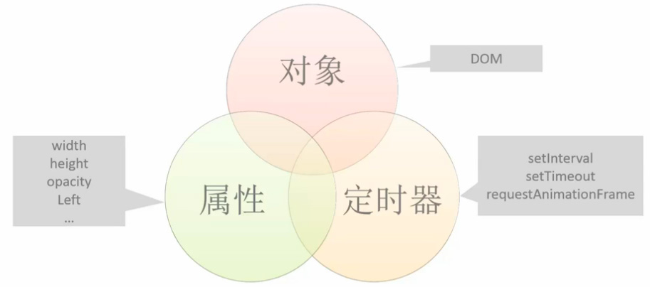

[TOC]

# BOM入门

## window对象
### Window 事件

| 事件名          | 描述                              |
| ------------ | ------------------------------- |
| load         | 文档和所有图片完成加载时                    |
| unload       | 离开当前文档时                         |
| beforeunload | 和 unload  类似，但是它提供询问用户是否确认离开的机会 |
| resize       | 拖动改变浏览器窗口大小时                    |
| scroll       | 拖动浏览器时                          |

### Window 方法

| 方法                                       | 描述        |
| ---------------------------------------- | --------- |
| alert(), confirm() 返回真假, prompt() 返回用户输入值 | 三种对话框     |
| setTimeout(), setInterval()              | 计时器       |
| open(), close()                          | 开启窗口，关闭窗口 |


NOTE：对话框会阻塞线程。
打开或关闭窗口

```
var w = window.open('subwindow.html', 'subwin', 'width=300, height=300, status=yes, resizable=yes');
// 既可关闭窗口
w.close();
```

NOTE：无需记忆，更多属性在使用时查询文档。

### 计时器

#### 延时定时：setTimeOut

语法：setTimeOut(callback, time);

1. 回掉函数，执行的函数
2. 延时时间（单位：ms）
3. 返回值：用于清除定时器的id

#### 清除延时定时器：clearTineout

语法：clearTineout(id);

#### 间歇定时：setInterval

语法：setInterval(callback, time);

1. 回掉函数，执行的函数
2. 间歇时间（单位：ms）
3. 返回值：用于清除定时器的id

#### 清除间歇定时器：clearInterval

语法：clearInterval(id);

#### requestAnimationFrame

类似于 setTimeout 但是无需设定时间间隔。此定时器为 HTML5中的新标准，其间隔时间不由用户控制，而是由显示器的刷新频率决定。（市面上的显示器刷新频率为每秒刷新60次）

优势
- 无需设置间隔时间
- 动画流畅度高

```
var requestId = requestAnimationFrame(func);
cancelAnimationFrame(requestId);
```

NOTE：使用它来实现动画与 setTimeout 类似，需要每次每帧结束时再次调用。不可设置时间间隔（系统决定），时间间隔为16.67毫秒一帧。

# 动画[^注释]

帧，为动画的最小单位，一个静态的图像。

帧频，每秒播放的帧的数量。

一个动画是由很多帧组成的，因为人眼的暂留特性，当图片交替的速度大于每秒30 帧以上既有动画的感觉。

## 实现方式

- gif     图像形式存储，容量大，需第三方制图工具制作。
- flash     需要第三方制作工具，不推荐。
- CSS3 实现动画具有局限性
- JavaScript     可实现大部分上面几类可实现的动画效果

## JavaScript 动画三要素



### 常见动画

大多的复杂动画都是有下列的简单动画所组成的。

- 形变，改变元素的宽高
- 位移，改变元素相对位置
- 旋转
- 透明度
- 其他…

### 动画封装

```
/**
 * 缓动动画封装(回掉函数)
 * @param {Element}obj
 * @param json
 * @param callback  回掉函数
 */
var animat = function (obj, json, callback) {
    var STEP = 15; // 步数（间歇的时间）
    var SPEED = 10;  // 速度
    clearInterval(obj.timer);
    var step = function () {
        var flag = true;
        for (var k in json) {
            var attr = k;
            var end = json[k];
            var current = getCSSstyle(obj, attr);
            if (k === "opacity") {
                end = end * 1000;
                current = current * 1000;
            }
            current = parseInt(current) || 0;
            var speed = (end - current) / SPEED;
            speed = speed > 0 ? Math.ceil(speed) : Math.floor(speed);
            if (k === "opacity") {
                obj.style[attr] = (current + speed) / 1000;
            } else {
                obj.style[attr] = k === "zIndex" ? end : current + speed + "px";
            }
            if (current != end) {
                flag = false;
            }
        }
        if (flag) {
            clearInterval(obj.timer);
            callback && callback();
        }
    };
    obj.timer = setInterval(step, STEP);
};


//获取盒子cssStyle
function getCSSstyle(ele, attr) {
    if (window.getComputedStyle) {
        return window.getComputedStyle(ele, null)[attr];
    } else {
        return ele.currentStyle[attr]; // ie6~8
    }
}
```


# offset系列

### offsetWidth与offsetHeight

1. 获取的是盒子自身的宽与高（number）
2. 是只读属性
3. offsetWidth = width + padding + border;

### offsetParent

1. 找最近的定位的祖先元素

### offsetLeft与offsetTop

1. 距离offsetParent的margin+本身距离


# scroll系列

### scrollWidth与scrollHeight

1. 获取的盒子内容的宽高（包含padding）

### scrollTop与scrollLeft

1. 获取滚动条卷去的


### scroll：滚动事件

1. 注册滚动事件

   ```
   window.onscroll = function(){}
   ```

2. 获取兼容性问题

   *  现在浏览器（除IE6~8除外）window.pageYOffset

   *  IE和IE678 document.documentElement.scrllTop

   *  未声明DTD document.body.scrollTop

        ```
        /**
      * 获取页面的去像素
      * @returns {{top: (Number|number), left: (Number|number)}}
      */
      function getScroll() {
         return {
             top: window.pageYOffset || document.documentElement.scrollTop || document.body.scrollTop || 0,
             left: window.pageXOffset || document.documentElement.scrollLeft || document.body.scrollLeft || 0
         }
      }
        ```

# client系列

### clientWidth与clientHeight

1. 获取盒子的可视宽高
2. 兼容性
   -  现在浏览器（除IE6~8除外）window.innerWidth

   -  IE和IE678 document.documentElement.clientWidth

   -  未声明DTD document.body.clientWidth

        ```
        /**
      * 获取页面可视区域的宽度和高度
      * @returns {{width: (Number|number), height: (Number|number)}}
      */
      function getclient() {
         return {
             "width": window.innerWidth || document.documentElement.clientWidth || document.body.clientWidth || 0,
             "height": window.innerHeight || document.documentElement.clientHeight || document.body.clientHeight || 0
         };
      }
        ```

### clientTop与clientLeft

1. 获取边框的距离（包含滚动条）


# 获取CSS设置所有样式

#### window.getComputedStyle(element,[pseudoElt])

1. element：需要获取的元素的样式
2. pseudoElt：获取元素的伪元素的样式，不需要获取伪元素样式时为null
3. Object：返回值css样式对象

> NOTE：IE6~8不支持

## 兼容性封装

```
/**
 * 获取CSS设置的所有样式（兼容性）
 * @param {Element}ele  元素
 * @param {String}s 属性
 * @returns {*} 返回值
 */ 
function getCSSstyle(ele, attr) {
    if (window.getComputedStyle) {
        return window.getComputedStyle(ele, null)[attr];
    } else {
        return ele.currentStyle[attr]; // ie6~8
    }
}
```


# 了解

| 属性名       | 描述       |
| --------- | -------- |
| navigator | 浏览器信息    |
| location  | 浏览器定位和导航 |
| history   | 窗口浏览器历史  |
| screen    | 屏幕信息     |

### Navigator

navigator.userAgent

- Chrome

- -  Mozilla/5.0(Windows NT 6.1; WOW64)      AppleWebKit/37.36 (KHTML, like Gecko) Chrome/40.0.2214.115 Safari/537.36

- Firefox

- - Mozilla/5.0(Windows      NT 6.1; WOW64; rv:36.0) Gecko/20100101 Firefox/36.0

- IE

- - Mozilla/5.0      (Windows NT 6.1; WOW64; Trident/7.0; SLCC2; .NET CLR 2.0.50727; .NET CLR      3.5.30729; .NET CLR 3.0.30729; Media Center PC 6.0; .NET4.0C; .NET4.0E;      InfoPath.3; rv:11.0) like Gecko

NOTE：可以通过 userAgent 判断浏览器。

### Location

代表浏览器的定位和导航。可以使用 location 来操作 URL 中的各个部分。

最常用的有 href 属性，当前访问资源的完整路径。

```
http://www.github.com:8080/index.html?user=li-xinyang&lang=zh-CN#home
  |          |          |       |                  |              |
protocol     |          |       |                  |              |
          hostname     port     |                  |              |
              \        /    pathname             search          hash
              	host
```

**方法**

- assign(url) 载入新的 url，记录浏览记录
- replace(url) 载入新的 url 不记录浏览记录
- reload() 重新载入当前页

### History

浏览器当前窗口的浏览历史。

length: 9state: null __proto__: History

方法

- back(int) 后退
- forward(int) 前进
- go(int) 正数向前，附属向后

### Screen 

其中包含屏幕信息。其中 avil- 开头的属性为可用属性，其余则为显示器设备属性。


[^注释]: 1秒执行25次就会有动画效果，1秒执行60次动画效果就比较细腻；